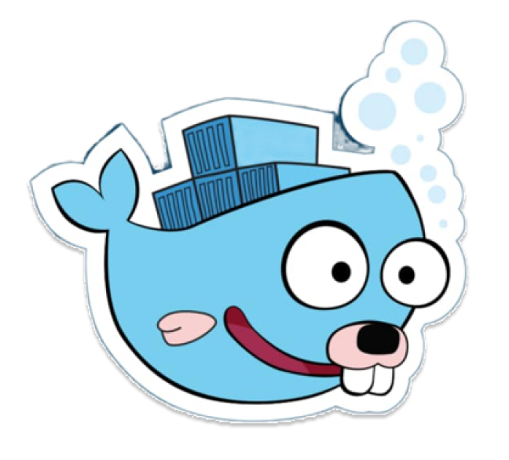

 

  
  <picture>
    <source media="(prefers-color-scheme: dark)" srcset="img/title_light.png">
    <source media="(prefers-color-scheme: light)" srcset="img/title_dark.png">
    
  </picture>  
  
   

  &nbsp;&nbsp;&nbsp;&nbsp;

<h2>Hi there,  Good Day</h2>

  

  

I am a final-year student majoring in **Network & Information Security** at Vietnam – Korea University of Information and Communications Technology **(VKU)**. I possess a strong foundation in **Linux, containerization, and system automation**. 

I am deeply passionate about building on-premises infrastructure, designing secure CI/CD pipelines, and transforming traditional networks into **Infrastructure as Code (IaC)**. Currently, I am seeking a **DevOps Intern/Fresher** position to contribute to building secure, stable systems and develop into a professional DevOps Engineer.

  

  <b>Contact me: </b>&nbsp;&nbsp;&nbsp;&nbsp;&nbsp;&nbsp;&nbsp;

  

<picture>
  <source media="(prefers-color-scheme: dark)" srcset="https://raw.githubusercontent.com/Bel7phegor/Bel7phegor/output/pacman-contribution-graph-dark.svg">
  <source media="(prefers-color-scheme: light)" srcset="https://raw.githubusercontent.com/Bel7phegor/Bel7phegor/output/pacman-contribution-graph.svg">
  
</picture>

  

###  Skills & Tools

#### DevOps & Cloud

  

#### Networking & Security

  
  
  
  
  
  

  

###  Professional Focus
  

- **DevOps & CI/CD:** Architecting highly available systems on **AWS** and managing containerized applications with **Docker** and **Kubernetes**. Building automated, secure CI/CD pipelines via **GitHub Actions** with embedded DevSecOps tools (Trivy, Snyk).
- **Networking & Security:** Solid foundation in **CCNA** knowledge (TCP/IP, OSI, OSPF, VLAN, NAT). Experienced in configuring and troubleshooting enterprise Routing & Switching infrastructure, firewalls (**pfSense**), and **IPsec VPN** through hands-on labs in **GNS3**.
- **NetDevOps & Automation:** Transforming traditional network management into Infrastructure as Code (**Terraform IaC**). Leveraging **Ansible** and scripting to automate configurations and critical backups for network switches, routers, and firewalls.
- **Monitoring & Observability:** Deploying comprehensive full-stack monitoring solutions utilizing **Prometheus**, **Grafana**, and **Alertmanager**. Proficient in tracking health metrics for both Linux servers and networking devices (via SNMP Exporter).

  

  

###  GitHub Stats 

  &nbsp;&nbsp;

  

